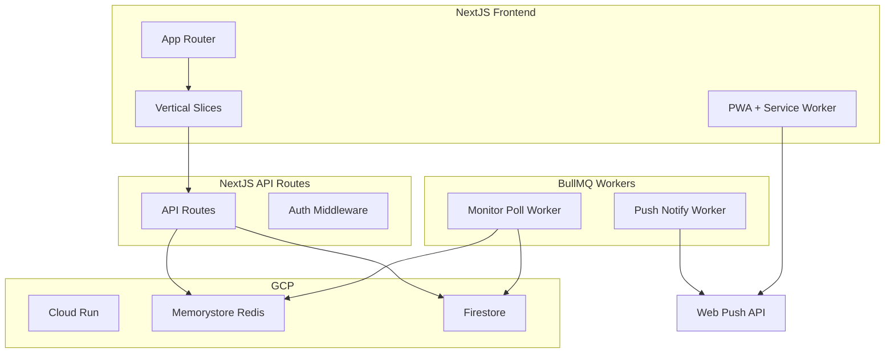
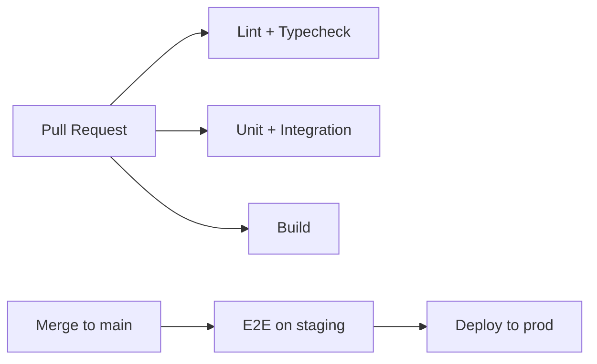

# Short Track App - New Monorepo Plan

## Marshrutify Logic to Port (Relevant for Short Track)

The Marshrutify codebase has no explicit "short track" concept; it monitors **bus seat availability** for routes and dates. The following logic is essential to replicate:

### Core Business Logic


| Component            | Location                                                                                                         | Purpose                                                                                                                           |
| -------------------- | ---------------------------------------------------------------------------------------------------------------- | --------------------------------------------------------------------------------------------------------------------------------- |
| **Bus provider API** | `[src/service/busProvider/MarshrutochkaService.ts](Marshrutify/src/service/busProvider/MarshrutochkaService.ts)` | `getAvailableTimeSlots(from, to, date)` - fetches schedule HTML/JSON, parses `.nf-route` elements for time strings (e.g. "12:45") |
| **Slot diff**        | `[src/service/monitorService.ts](Marshrutify/src/service/monitorService.ts)`                                     | `getDiffOfSlots(prevSlots, currSlots)` using `fast-array-diff` - returns `{ added, removed }`                                     |
| **Monitor flow**     | `[src/service/stepFunctionsMonitorService.ts](Marshrutify/src/service/stepFunctionsMonitorService.ts)`           | Start/stop/prolong monitor; state machine orchestrates polling every 20s                                                          |
| **Data model**       | `[src/types/monitor.ts](Marshrutify/src/types/monitor.ts)`                                                       | `MonitorData`: userId, busProvider, from, to, date (yyyy-mm-dd); `MonitorEventData`: prevSlots, timeOutTime                       |
| **Destinations**     | `[MarshrutochkaService](Marshrutify/src/service/busProvider/MarshrutochkaService.ts)`                            | `getFromDestinations()`, `getToDestinations(from)` - city lists for route selection                                               |
| **Notification**     | `[src/client/telegram/service.ts](Marshrutify/src/client/telegram/service.ts)`                                   | `notifyAboutAvailability({ added, removed, monitorInfo })` - format and send to user                                              |


### Current Lambda → BullMQ Mapping


| Lambda                                    | Role                             | BullMQ Equivalent                          |
| ----------------------------------------- | -------------------------------- | ------------------------------------------ |
| `spotMonitorTick`                         | Poll bus API, diff slots, notify | **Repeatable job** (every 20s per monitor) |
| `handleMonitorStarted`                    | Confirm monitor start            | **One-off job** on monitor creation        |
| `handleMonitorUnsubscriptionNotification` | Ask user to prolong              | **Delayed job** + callback                 |
| `handleMonitorUnsubscription`             | Stop monitor                     | **One-off job** on timeout                 |
| `botHandler`                              | Telegram webhook                 | **HTTP handler** (NextJS API route)        |


---

## Proposed Architecture




---

## Monorepo Structure

```
short-track/
├── apps/
│   └── web/                    # NextJS 14+ App Router
│       ├── app/
│       │   ├── (auth)/         # Auth routes
│       │   ├── (main)/         # Main app
│       │   │   ├── trips/      # Vertical slice: trips
│       │   │   ├── monitors/   # Vertical slice: monitors
│       │   │   └── layout.tsx
│       │   └── api/
│       │       ├── bus/        # Bus provider proxy
│       │       ├── monitors/   # Monitor CRUD + jobs
│       │       └── push/       # Push subscription
│       ├── components/         # Shared presentational
│       ├── lib/                # Shared client utils
│       └── public/
│           ├── manifest.json
│           └── sw.js           # Service worker
├── packages/
│   ├── bus-provider/           # Marshrutochka API client
│   ├── monitor-core/           # Monitor logic, diff, types
│   ├── queue/                  # BullMQ queues + workers
│   └── ui/                     # Radix primitives, design tokens
├── workers/                    # Standalone BullMQ worker process
│   └── monitor-worker.ts
├── terraform/                  # GCP infra
├── .github/workflows/          # CI/CD
└── package.json                # Turborepo/nx root
```

---

## Tech Stack

- **Framework**: NextJS 14+ (App Router)
- **Styling**: CSS Modules + Radix UI
- **State**: React Query (server state), Zustand (client)
- **Queue**: BullMQ + Redis (Memorystore)
- **DB**: Firestore (or Cloud SQL if relational preferred)
- **Auth**: NextAuth.js (OpenID-ready) + future Telegram provider
- **Push**: Web Push API + `web-push` library
- **PWA**: `next-pwa` or custom Workbox service worker

---

## Vertical Slices + Container/Presentational

Each slice under `app/(main)/<slice>/`:

```
trips/
├── _components/
│   ├── TripDateDisplay.tsx      # Presentational
│   ├── TripDateDisplayContainer.tsx  # Container (data fetching)
│   └── TripRouteSelector.tsx
├── page.tsx
└── layout.tsx
```

- **Container**: Fetches data, maps to props, handles side effects
- **Presentational**: Pure UI, receives props, no data fetching

---

## Feature Implementation

### 1. Display Trip Date/Time

- **API**: `GET /api/bus/slots?from=&to=&date=` → proxy to Marshrutochka (or `packages/bus-provider`)
- **UI**: `TripDateDisplay` shows date, route (from→to), and available time slots in a list/cards
- **Data**: Reuse `AvailableTimeSlot` (string), `DestinationInfo`, `getAvailableTimeSlots` from Marshrutify

### 2. Replace Lambdas with BullMQ

- **Queues**: `monitor:poll`, `monitor:notify`, `monitor:started`, `monitor:unsubscribe`
- **Repeatable job**: `monitor:poll` with `repeat: { every: 20000 }` per active monitor
- **Worker**: Single process (`workers/monitor-worker.ts`) that:
  - Fetches slots via `bus-provider`
  - Diffs via `monitor-core`
  - Enqueues `monitor:notify` on `added.length > 0`
- **Storage**: Firestore collections `monitors`, `users` (replace DynamoDB)

### 3. Push Notifications (Unoccupied Seats)

- **Subscription**: `POST /api/push/subscribe` stores `PushSubscription` in Firestore per user
- **Trigger**: When `added` slots exist, worker calls `web-push.sendNotification(subscription, payload)`
- **Payload**: `{ title: "Seats available", body: "12:45, 14:30", url: "/monitors/123" }`
- **VAPID**: Store keys in Secret Manager, inject into worker env

### 4. Offline PWA

- **Manifest**: `manifest.json` with icons, name, start_url
- **Service worker**: Cache static assets, API responses for `/api/bus/slots` (stale-while-revalidate)
- **Offline fallback**: Show cached trip data or "You're offline" message
- **Install prompt**: Custom banner for "Add to Home Screen"

### 5. Auth (Future: OpenID / Telegram)

- **NextAuth.js**: Configure OpenID providers (Google, etc.)
- **Telegram**: Custom provider using Telegram Login Widget or bot-based auth
- **Session**: JWT in cookie; use for `userId` in monitors and push subscriptions

---

## Tests Strategy


| Layer           | Tool         | Scope                                                                         |
| --------------- | ------------ | ----------------------------------------------------------------------------- |
| **Unit**        | Vitest       | `packages/monitor-core` (diff, date utils), `packages/bus-provider` (parsing) |
| **Integration** | Vitest + MSW | API routes with mocked Firestore/Redis                                        |
| **E2E**         | Playwright   | Critical flows: select route → create monitor → receive push                  |
| **Contract**    | (optional)   | Marshrutochka API response shape                                              |


**Coverage targets**: Core packages >80%, API routes >70%

---

## CI/CD Strategy




- **On PR**: `lint`, `typecheck`, `test`, `build` (Turborepo)
- **On merge to main**: Run E2E against staging, then deploy
- **Staging**: Auto-deploy from `main` to GCP staging project
- **Prod**: Manual approval or tagged release

---

## Deployment Strategy (Terraform + GCP)


| Resource                       | Purpose                                             |
| ------------------------------ | --------------------------------------------------- |
| **Cloud Run**                  | NextJS app (serverless container)                   |
| **Cloud Run Job** or **GCE**   | BullMQ worker (long-running or cron-triggered)      |
| **Memorystore (Redis)**        | BullMQ backend                                      |
| **Firestore**                  | Monitors, users, push subscriptions                 |
| **Secret Manager**             | VAPID keys, Marshrutochka credentials, auth secrets |
| **Cloud Scheduler** (optional) | Trigger worker if not always-on                     |
| **Load Balancer**              | HTTPS, custom domain                                |


**Terraform layout**:

```
terraform/
├── main.tf
├── variables.tf
├── modules/
│   ├── cloud-run/
│   ├── redis/
│   ├── firestore/
│   └── secrets/
└── environments/
    ├── staging/
    └── prod/
```

**Build**: Dockerfile for NextJS (standalone output), separate Dockerfile for worker. Push to Artifact Registry, deploy via Cloud Run.

---

## Migration Path from Marshrutify

1. **Phase 1**: Monorepo scaffold, `bus-provider` + `monitor-core` packages, NextJS app with trip display
2. **Phase 2**: BullMQ worker, Firestore schema, monitor CRUD API
3. **Phase 3**: Push subscriptions, worker integration
4. **Phase 4**: PWA, offline support
5. **Phase 5**: Auth (OpenID, Telegram)
6. **Phase 6**: Terraform, CI/CD, production deployment

---

## Open Questions

- **Marshrutochka API**: Same base URL and params as Marshrutify? Confirm CORS/rate limits for server-side calls.
- **Worker hosting**: Prefer Cloud Run Job (ephemeral) vs GCE VM (always-on) for BullMQ workers.
- **Firestore vs Cloud SQL**: Firestore fits document model (monitors, users); Cloud SQL if relational queries needed later.

