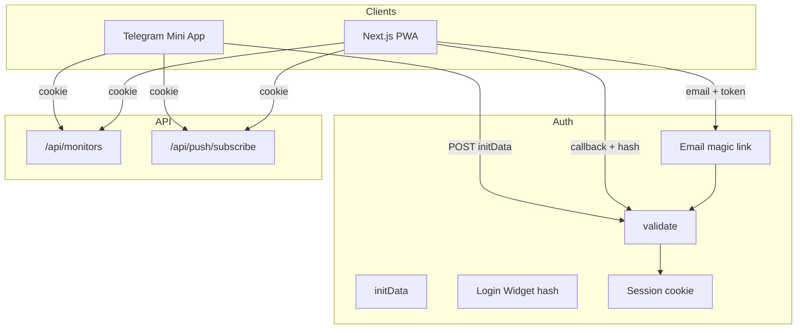

# План: Telegram Mini App, PWA (Telegram + email)

## Цель

Единая аутентификация и сессия (cookie) для всех клиентов:

- **Telegram Mini App** — пользователь открывает приложение из бота; бэкенд проверяет `initData`, выставляет сессию.
- **Next.js PWA** — два способа входа:
  - **Вход через Telegram** — кнопка «Войти через Telegram» (Login Widget); после редиректа бэкенд проверяет `hash`, выставляет сессию.
  - **Вход по email** — пользователь вводит email, получает magic link; переход по ссылке верифицирует токен и выставляет ту же сессию.

Один формат сессии и один API для Mini App и PWA независимо от способа входа.

## Текущее состояние

- Auth отсутствует: `userId` передаётся с клиента в body/query ([apps/web/app/api/monitors/route.ts](shortack/apps/web/app/api/monitors/route.ts)).
- GET/DELETE `/api/monitors/[id]` не проверяют владельца ([apps/web/app/api/monitors/[id]/route.ts](shortack/apps/web/app/api/monitors/[id]/route.ts)).

## Архитектура

## 1. Бэкенд: валидация и сессия

### 1.1 Два способа проверки данных от Telegram

**Mini App (initData):**

- Данные: query-строка с полями `user`, `auth_date`, `hash` и др.
- secret_key = HMAC-SHA256(bot_token, `"WebAppData"`).
- data_check_string = поля кроме `hash`, отсортированные по ключу, формат `key=value`, разделитель `\n`.
- Проверка: `hex(HMAC-SHA256(data_check_string, secret_key)) === hash`.
- Ссылка: [Validating data received via the Mini App](https://core.telegram.org/bots/webapps#validating-data-received-via-the-mini-app).

**Login Widget (PWA):**

- Данные приходят в query при редиректе: `id`, `first_name`, `last_name`, `username`, `photo_url`, `auth_date`, `hash`.
- secret_key = SHA256(bot_token) (не HMAC с "WebAppData").
- data_check_string = все поля кроме `hash`, отсортированные по ключу, `key=value`, разделитель `\n`.
- Проверка: `hex(HMAC-SHA256(data_check_string, secret_key)) === hash`.
- Ссылка: [Telegram Login Widget — Checking authorization](https://core.telegram.org/widgets/login#checking-authorization).

### 1.2 Реализация

- **Env**: `TELEGRAM_BOT_TOKEN` (из BotFather).
- **Модуль** (например `lib/telegram-auth.ts`):
  - `validateInitData(initData: string): { user: WebAppUser } | null` — для Mini App.
  - `validateLoginWidgetPayload(query: Record<string, string>): { id, first_name, username?, ... } | null` — для PWA callback.
  - Проверка `auth_date` в обоих случаях (например не старше 24 часов).
- **UserId**: единый формат для сессии и Firestore — `tg_${telegram_id}` для Telegram; для email — `email_${stable_id}` (например SHA256(email).slice(0,16) или id документа пользователя в Firestore), чтобы один и тот же пользователь всегда получал один userId.

### 1.3 API auth и сессия

- **POST /api/auth/telegram** (для Mini App):
  - Body: `{ initData: string }`.
  - Вызвать `validateInitData(initData)`; при ошибке — 401.
  - Создать сессию (payload: `userId`, `telegramId`, `exp`), подписать, записать в HTTP-only cookie.
  - Ответ: 200 + cookie, опционально `{ userId }`.
- **GET /api/auth/telegram/callback** (для PWA — callback после Login Widget):
  - Query: `id`, `first_name`, `auth_date`, `hash`, и др.
  - Вызвать `validateLoginWidgetPayload(query)`; при ошибке — 401 или редирект на страницу входа с ошибкой.
  - Создать ту же сессию (тот же формат cookie, что и для Mini App).
  - Редирект на главную PWA (например `/trips` или `/`).
- **getSession(request: NextRequest): { userId: string } | null** — читает cookie, проверяет подпись и TTL. Использовать во всех защищённых API.

### 1.4 Вход по email (PWA)

- **Сценарий**: пользователь вводит email на странице `/login` → бэкенд генерирует одноразовый токен (crypto.randomBytes), сохраняет в хранилище (Firestore коллекция `auth_tokens` или Redis) с привязкой к email и TTL (например 15–60 минут) → отправляет письмо со ссылкой вида `https://<domain>/api/auth/email/verify?token=...`.
- **POST /api/auth/email** (запрос magic link):
  - Body: `{ email: string }`. Валидация формата email; rate limit по IP/email (защита от спама).
  - Создать запись токена (token, email, expiresAt), отправить письмо (Nodemailer, SendGrid, Resend и т.п.). Ответ: 200 «Если email найден, ссылка отправлена» (не раскрывать, зарегистрирован ли email).
- **GET /api/auth/email/verify**:
  - Query: `token`. Найти запись по токену, проверить TTL; при успехе вычислить userId для email (например `email_${hash(email)}` или создать/найти документ пользователя в Firestore и использовать его id), создать сессию (тот же формат cookie, что и для Telegram), удалить или инвалидировать токен, редирект на `/trips` или `/`.
  - При неверном/истёкшем токене — редирект на `/login?error=invalid_token`.
- **Env**: переменные для SMTP или API почтового сервиса (e.g. `EMAIL_FROM`, `RESEND_API_KEY` или `SMTP_*`). Ссылка в письме должна вести на тот же домен, что и приложение.

Сессия после email-входа ничем не отличается от сессии после Telegram — API использует `getSession()` и получает `userId` в едином формате.

## 2. Интеграция API с сессией

- **POST /api/monitors**: при наличии сессии брать `userId` из неё, иначе из body (обратная совместимость).
- **GET /api/monitors**: при наличии сессии — из сессии, иначе из query `userId`.
- **GET/DELETE /api/monitors/[id]**: при наличии сессии проверять `monitor.userId === session.userId`; иначе 403. Без сессии — текущее поведение.
- **POST /api/push/subscribe**: при наличии сессии подставлять `userId` из сессии; иначе из body.

Итог: один API для Mini App (всегда с cookie) и для PWA (с cookie после входа через Telegram или без cookie в режиме без auth).

## 3. Telegram Mini App (клиент)

- **Route group** `(tg)` с корнем `/tg`; layout подключает `telegram-web-app.js`, проверяет `window.Telegram?.WebApp`, при отсутствии — «Open from Telegram».
- При загрузке: читать `Telegram.WebApp.initData` → `POST /api/auth/telegram` с `credentials: 'include'` → дальше все запросы с cookie.
- Контекст (например `TgAuthProvider`) хранит `userId` после успешного auth; страницы `/tg/trips`, `/tg/monitors` используют его, без ручного ввода.
- Не показывать PWA install prompt в layout (tg).

## 4. PWA: страница входа (Telegram + email)

- **Страница входа** (например `/login`):
  - **Вход через Telegram** — кнопка «Войти через Telegram», [Telegram Login Widget](https://core.telegram.org/widgets/login) с callback URL `https://<domain>/api/auth/telegram/callback`. Редирект с Telegram → валидация → set cookie → redirect на `/trips`.
  - **Вход по email** — форма с полем email и кнопкой «Отправить ссылку». Отправка на `POST /api/auth/email`; на экране сообщение «Проверьте почту». Переход по ссылке из письма → `GET /api/auth/email/verify?token=...` → set cookie → redirect на `/trips`.
- В **layout (main)** или в общем компоненте: при отсутствии сессии — кнопка входа или редирект на `/login`. После входа (Telegram или email) все запросы с `credentials: 'include'`; `userId` из сессии.

Итог: PWA может войти через Telegram или по email; Mini App — только через Telegram. Одна cookie-сессия и один API для всех.

## 5. Бот и деплой

- Создать бота в BotFather, получить токен; в настройках бота указать Mini App URL: `https://<domain>/tg`.
- `TELEGRAM_BOT_TOKEN` в env (и в Secret Manager в проде).
- Cookie: HttpOnly, Secure в проде, SameSite Lax; разумный TTL (например 24h).

## 6. Порядок внедрения

1. Модуль валидации (initData + Login Widget), `getSession()`, POST `/api/auth/telegram`, GET `/api/auth/telegram/callback`.
2. Вход по email: хранилище токенов (Firestore/Redis), отправка писем, POST `/api/auth/email`, GET `/api/auth/email/verify`; единый формат сессии для Telegram и email.
3. Подключить сессию в API monitors и push/subscribe; проверка владельца для GET/DELETE `/api/monitors/[id]` при наличии сессии.
4. Mini App: route group `(tg)`, layout, auth при загрузке, страницы `/tg`.
5. PWA: страница `/login` с выбором «Войти через Telegram» и «Войти по email» (форма + magic link); в (main) при отсутствии сессии — кнопка входа или анонимный режим.
6. Бот в BotFather, настройка URL Mini App; настройка почтового сервиса для email; тестирование всех сценариев входа.

