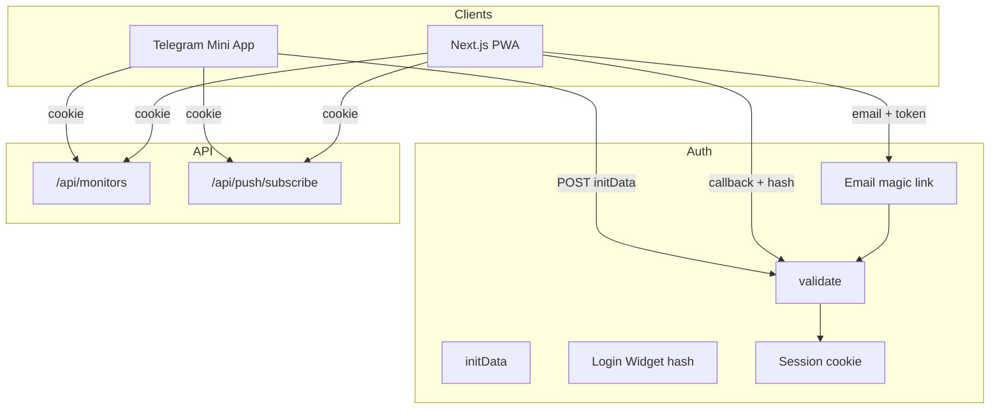

# План: Telegram Mini App, PWA (Telegram + email)

## Цель

Один формат сессии (HTTP-only cookie) и один API для всех клиентов:

- **Telegram Mini App** — проверка `initData`, установка сессии.
- **PWA** — вход через Telegram (Login Widget) или по email (magic link); та же сессия.

## Текущее состояние

- **Auth отсутствует:** `userId` приходит с клиента в body/query:
  - [apps/web/app/api/monitors/route.ts](shortack/apps/web/app/api/monitors/route.ts) — POST/GET берут `userId` из body/query.
  - [apps/web/app/api/push/subscribe/route.ts](shortack/apps/web/app/api/push/subscribe/route.ts) — `userId` из body.
- **Нет проверки владельца:** [apps/web/app/api/monitors/[id]/route.ts](shortack/apps/web/app/api/monitors/[id]/route.ts) — GET/DELETE отдают/удаляют монитор без проверки `monitor.userId`.

## Архитектура

## 1. Бэкенд: валидация и сессия

### 1.1 Модуль валидации Telegram

- **Mini App (initData):** query-строка с `user`, `auth_date`, `hash`. secret_key = HMAC-SHA256(bot_token, "WebAppData"); data_check_string — поля кроме `hash`, сортировка по ключу, `key=value`, `\n`. Проверка: hex(HMAC-SHA256(data_check_string, secret_key)) === hash. Документация: [Validating data received via the Mini App](https://core.telegram.org/bots/webapps#validating-data-received-via-the-mini-app).
- **Login Widget (PWA):** query при редиректе: `id`, `first_name`, `auth_date`, `hash` и др. secret_key = SHA256(bot_token). Аналогичная сборка data_check_string и проверка hash. Документация: [Telegram Login Widget](https://core.telegram.org/widgets/login#checking-authorization).
- **Env:** `TELEGRAM_BOT_TOKEN`.
- **Новый модуль** (например `apps/web/lib/telegram-auth.ts`):
  - `validateInitData(initData: string): { user } | null`
  - `validateLoginWidgetPayload(query: Record<string, string>): { id, first_name, username?, ... } | null`
  - Проверка `auth_date` (например не старше 24 ч).
- **UserId:** `tg_${telegram_id}` для Telegram; для email — `email_${stable_id}` (например hash от email), один формат в сессии и Firestore.

### 1.2 Сессия и утилита

- **getSession(request: NextRequest): { userId: string } | null** — чтение cookie, проверка подписи и TTL. Общая утилита для защищённых API (например в `lib/session.ts`).
- Payload сессии: `userId`, при необходимости `telegramId`, `exp`. Cookie: HttpOnly, Secure в проде, SameSite Lax, TTL ~24h.

### 1.3 API auth (Telegram)

- **POST /api/auth/telegram** — body `{ initData }`. Вызов `validateInitData`, при ошибке 401. Создание сессии, запись в cookie. Ответ 200 + cookie, опционально `{ userId }`.
- **GET /api/auth/telegram/callback** — query от Login Widget. Вызов `validateLoginWidgetPayload`, при ошибке 401 или редирект на `/login?error=...`. Та же сессия (тот же cookie). Редирект на `/trips` или `/`.

### 1.4 Вход по email (PWA)

- Хранилище одноразовых токенов: Firestore (коллекция `auth_tokens`) или Redis — token, email, expiresAt (15–60 мин).
- **POST /api/auth/email** — body `{ email }`. Валидация, rate limit. Создание токена, отправка письма со ссылкой `https://<domain>/api/auth/email/verify?token=...`. Ответ 200 без раскрытия, зарегистрирован ли email.
- **GET /api/auth/email/verify** — по `token` найти запись, проверить TTL; вычислить userId для email, создать сессию (тот же формат cookie), инвалидировать токен, редирект на `/trips` или `/`. При ошибке — редирект на `/login?error=invalid_token`.
- Env для почты: `EMAIL_FROM`, `RESEND_API_KEY` или `SMTP_*`.

## 2. Интеграция API с сессией

- **POST /api/monitors** ([route.ts](shortack/apps/web/app/api/monitors/route.ts)): при наличии сессии брать `userId` из `getSession()`, иначе из body (обратная совместимость).
- **GET /api/monitors**: при наличии сессии — `userId` из сессии, иначе из query `userId`.
- **GET/DELETE /api/monitors/[id]** ([route.ts](shortack/apps/web/app/api/monitors/[id]/route.ts)): при наличии сессии проверять `monitor.userId === session.userId`; иначе 403. Без сессии — текущее поведение.
- **POST /api/push/subscribe** ([route.ts](shortack/apps/web/app/api/push/subscribe/route.ts)): при наличии сессии подставлять `userId` из сессии; иначе из body.

## 3. Telegram Mini App (клиент)

- **Route group** `(tg)` с корнем `/tg`: `app/(tg)/layout.tsx` и страницы под `/tg`.
- Layout: подключение `telegram-web-app.js`, проверка `window.Telegram?.WebApp`; при отсутствии — сообщение «Open from Telegram». Не показывать PWA install prompt.
- При загрузке: читать `Telegram.WebApp.initData` → `POST /api/auth/telegram` с `credentials: 'include'` → дальше все запросы с cookie.
- Контекст (например `TgAuthProvider`) хранит `userId` после успешного auth; страницы `/tg/trips`, `/tg/monitors` используют его без ручного ввода.

## 4. PWA: страница входа

- **Страница** `/login` (в (main)):
  - Кнопка «Войти через Telegram» — Telegram Login Widget с callback URL `https://<domain>/api/auth/telegram/callback`.
  - Форма «Войти по email» — поле email, кнопка «Отправить ссылку» → POST `/api/auth/email`, сообщение «Проверьте почту». Переход по ссылке из письма → verify → cookie → redirect на `/trips`.
- В [apps/web/app/(main)/layout.tsx](shortack/apps/web/app/(main)/layout.tsx) (или общем компоненте): при отсутствии сессии — кнопка входа или редирект на `/login`. После входа все запросы с `credentials: 'include'`.

## 5. Бот и деплой

- Бот в BotFather, токен в `TELEGRAM_BOT_TOKEN`; в настройках бота — Mini App URL: `https://<domain>/tg`.
- Cookie и env (в т.ч. Secret Manager в проде) как выше.

## 6. Порядок внедрения

Реализация по шагам: модуль валидации + getSession + POST/GET auth/telegram; затем email (токены, письма, verify); затем подключение сессии в monitors и push/subscribe и проверка владельца для [id]; затем route group (tg) и страницы /tg; затем /login и интеграция в layout (main); в конце — бот, Mini App URL и тестирование сценариев входа.
