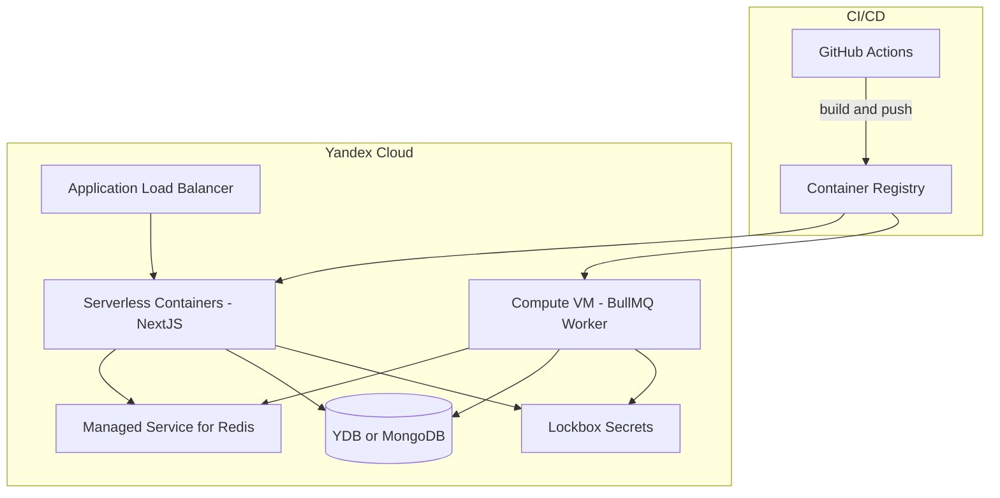

# План деплоя в Yandex Cloud и настройки CI/CD (Short Track)

Связь с основным планом приложения: [short_track_app_plan_b0e11aa2.plan.md](shortack/.cursor/plans/short_track_app_plan_b0e11aa2.plan.md). Текущий план опирается на стек: NextJS (apps/web), BullMQ worker (workers/), Redis, документное хранилище, секреты.

---

## 1. Варианты выбора (что настраивать)

Ниже — таблица решений. По каждому пункту можно выбрать один вариант и дальше следовать соответствующей ветке настройки.


| Компонент                             | Вариант A                                  | Вариант B                                               | Вариант C                                  | Рекомендация                             |
| ------------------------------------- | ------------------------------------------ | ------------------------------------------------------- | ------------------------------------------ | ---------------------------------------- |
| **Хостинг NextJS (web + API)**        | Serverless Containers (YC Serverless)      | Compute Cloud: VM + Docker                              | Managed Service for Kubernetes (K8s)       | A — проще и дешевле для старта           |
| **Хостинг BullMQ worker**             | Compute Cloud: одна VM, Docker             | Serverless Containers (если перейти на короткие задачи) | K8s (Deployment)                           | A — воркер долгоживущий, VM предсказуема |
| **Redis**                             | Managed Service for Redis                  | Self-hosted Redis на той же VM, что и воркер            | —                                          | A — отказоустойчивость и бэкапы          |
| **БД (мониторы, пользователи, push)** | YDB (Document API)                         | Managed Service for MongoDB                             | PostgreSQL (Managed) + схема под документы | A или B — документная модель как в плане |
| **Секреты**                           | Lockbox (Secret Manager)                   | Переменные окружения в CI (не для prod)                 | —                                          | A                                        |
| **Система CI/CD**                     | GitHub Actions                             | GitLab CI                                               | Yandex Cloud CI (в консоли YC)             | По наличию репозитория (GitHub/GitLab)   |
| **Окружения**                         | Staging + Production (два набора ресурсов) | Только Production                                       | Staging + Prod + Preview (per-PR)          | Staging + Prod для начала                |


Дальше в плане расписаны шаги под **рекомендуемый набор**: Serverless Containers (web), VM (worker), Managed Redis, YDB Document API или MongoDB, Lockbox, GitHub Actions, Staging + Prod.

---

## 2. Целевая архитектура в Yandex Cloud




---

## 3. Инфраструктура (Terraform)

- **Provider**: `yandex-cloud/yandex` в Terraform.
- **Ресурсы**: Container Registry, сервисный аккаунт для pull/push и для запуска контейнеров, VPC/подсети при необходимости, Lockbox-секреты (или только обёртка, сами значения — через `yc`/консоль).
- **Варианты размещения кода**:
  - **Вариант A**: один репозиторий Short Track, папка `terraform/` в корне (как в [плане приложения](shortack/.cursor/plans/short_track_app_plan_b0e11aa2.plan.md)).
  - **Вариант B**: отдельный репозиторий под инфраструктуру (например `shortack-infra`).

Структура каталогов (внутри `shortack/terraform/` при варианте A):

```
terraform/
├── main.tf
├── variables.tf
├── outputs.tf
├── modules/
│   ├── registry/
│   ├── serverless-containers/
│   ├── compute-worker/
│   ├── redis/
│   ├── db/          # YDB or MongoDB
│   └── lockbox/
└── environments/
    ├── staging/
    │   └── main.tf
    └── prod/
        └── main.tf
```

- **Состояние Terraform**: хранение state в Yandex Object Storage (bucket + DynamoDB-подобная блокировка через YDB или отдельный state backend) или в GitLab/GitHub (не рекомендуется для prod). Варианты выбора: Object Storage + блокировка vs локальный state для dev.

---

## 4. Образы и реестр

- **Два образа**:
  1. NextJS: Dockerfile в `apps/web/` (multi-stage, `output: 'standalone'`).
  2. Worker: Dockerfile в `workers/` (или корень `workers/Dockerfile`).
- **Реестр**: Yandex Container Registry. Сборка может быть в CI (GitHub Actions/GitLab) или через «Сборка образов» в самом реестре Yandex Cloud (ещё один вариант выбора в CI).

---

## 5. CI/CD — сценарии по выбранной системе

### 5.1 GitHub Actions (рекомендуемый вариант)

- **На PR**: lint, typecheck, test, build (Turborepo) — без деплоя.
- **При push в `main`**: сборка образов web и worker → push в Container Registry → деплой в **staging** (обновление Serverless Container + перезапуск VM или обновление образа на VM).
- **Prod**: по тегу (например `v`*) или вручную workflow_dispatch — деплой в **production** (те же шаги, другие переменные окружения/другой каталог Terraform).

Опции выбора:

- Триггер prod: только тег vs тег + ручной запуск.
- Сборка образов: в GitHub Actions vs в Yandex Container Registry (триггер из CI).

### 5.2 GitLab CI

- Аналогичная логика: стадии `lint`, `test`, `build`, `docker build/push`, `deploy staging` / `deploy prod`.
- Переменные и секреты — через GitLab CI/CD Variables; для доступа к Yandex Cloud — OAuth-токен или статический ключ сервисного аккаунта в переменных.

### 5.3 Yandex Cloud CI

- Сборка в среде Yandex Cloud, привязка к репозиторию (если подключён GitHub/GitLab). Ограничение: меньше гибкости, чем в GitHub Actions/GitLab CI; удобно, если всё держать внутри YC.

---

## 6. Порядок внедрения (пошагово)

1. **Выбор опций** из таблицы в разделе 1 (зафиксировать в одном месте, например в `docs/deployment/choices.md` или в ADR).
2. **Создание облака и каталога** в Yandex Cloud, включение биллинга, создание сервисного аккаунта для Terraform и для CI.
3. **Terraform**: модули для Container Registry, Lockbox (заглушки секретов), VPC при необходимости.
4. **Dockerfile для NextJS** в `apps/web/` и для воркера в `workers/`, проверка локальной сборки и push в реестр вручную.
5. **Terraform**: модули Serverless Containers (NextJS), Compute VM для воркера, Managed Redis, выбранная БД (YDB или MongoDB).
6. **Настройка секретов** в Lockbox (VAPID, креды Marshrutochka, NextAuth и т.д.) и подключение их к контейнеру и VM.
7. **CI pipeline**: первый вариант (например GitHub Actions) — lint/test/build на PR; на push в `main` — build images, push, deploy staging.
8. **Домен и TLS**: привязка домена к ALB/контейнеру (при необходимости), сертификат (например Yandex Certificate Manager или Let's Encrypt через скрипт в CI).
9. **Prod**: отдельный workflow или job для деплоя в production по тегу/вручную, с возможным ручным подтверждением.

---

## 7. Где хранить выбор опций

Чтобы не терять выбранные варианты:

- Добавить в репозиторий один конфиг или документ с итоговой матрицей решений (например `shortack/docs/deployment/choices.md` или секция в существующей документации). В плане можно ссылаться: «см. docs/deployment/».

После выбора опций можно сузить план до одной ветки (например только Serverless Containers + VM + Managed Redis + YDB + GitHub Actions + Staging/Prod) и реализовывать уже конкретные шаги Terraform и workflow-файлы.