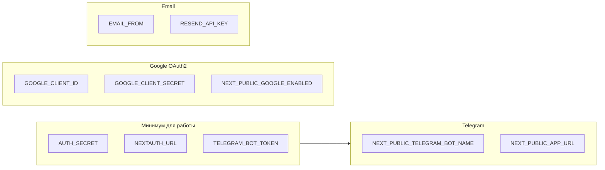

# API и конфигурация

Справочник по эндпоинтам аутентификации, переменным окружения и использованию сессии в API.

---

## Эндпоинты аутентификации

### NextAuth (общий обработчик)

| Метод | URL | Назначение |
|-------|-----|------------|
| GET/POST | `/api/auth/*` | Обработка signIn, signOut, session, callback OAuth и т.д. (см. [NextAuth Routes](https://next-auth.js.org/getting-started/rest-api)). |

Файл: `apps/web/app/api/auth/[...nextauth]/route.ts`. Конфигурация: `lib/auth.ts` (`authOptions`).

Основные URL для клиента:

- **Вход**: `signIn("telegram", { ... })` → POST на внутренний NextAuth endpoint.
- **Выход**: `signOut()` → вызов NextAuth signout.
- **Сессия**: `getSession()` / `useSession()` → GET `/api/auth/session`.

---

### Telegram Login Widget callback

| Метод | URL | Назначение |
|-------|-----|------------|
| GET | `/api/auth/telegram/callback` | Callback URL для Telegram Login Widget. Принимает query от Telegram, проверяет подпись, выдаёт одноразовый JWT и редиректит на `/login?telegram_token=...`. |

**Query (от Telegram):** `id`, `first_name`, `last_name`, `username`, `photo_url`, `auth_date`, `hash`, и др.

**Ответы:**

- Успех: `302` → `/login?telegram_token=<JWT>`.
- Ошибка валидации: `302` → `/login?error=invalid_telegram_auth`.
- Ошибка сервера (например, нет AUTH_SECRET): `302` → `/login?error=server_error`.

Файл: `apps/web/app/api/auth/telegram/callback/route.ts`.

---

### Email (magic link)

| Метод | URL | Назначение |
|-------|-----|------------|
| POST | `/api/auth/email` | Принять email, создать одноразовый токен в Firestore, отправить письмо со ссылкой. |
| GET | `/api/auth/email/verify` | Редирект на `/login?email_token=...&callbackUrl=...` (токен из query не проверяется здесь — проверка при signIn). |

**POST /api/auth/email**

- Body: `{ "email": "user@example.com" }`.
- Валидация: формат email.
- При успехе: запись в Firestore `auth_tokens`, отправка письма (Resend или в dev лог), ответ `200` с `{ "ok": true }`.
- Ошибки: `400` (invalid email), `500` (ошибка отправки или конфигурации почты).

**GET /api/auth/email/verify?token=...**

- Редирект на `/login?email_token=<token>&callbackUrl=/trips` (или другой origin из env).

Файлы: `apps/web/app/api/auth/email/route.ts`, `apps/web/app/api/auth/email/verify/route.ts`.

---

## Использование сессии в API

Защищённые роуты получают `userId` через NextAuth:

```ts
import { getServerSession } from "next-auth";
import { authOptions } from "@/lib/auth";

const session = await getServerSession(authOptions);
const userId = session?.user && "id" in session.user ? session.user.id : null;
```

Тип `session.user` расширен в `types/next-auth.d.ts`: добавлено поле `id` (string).

### Правила по роутам

| Роут | Поведение по userId |
|------|----------------------|
| **POST /api/monitors** | Если есть сессия — `userId` из сессии, иначе из body. Создание монитора с этим `userId`. |
| **GET /api/monitors** | Если есть сессия — `userId` из сессии, иначе из query `userId`. Список мониторов по `userId`. |
| **GET /api/monitors/[id]** | Если есть сессия — проверка `monitor.userId === session.user.id`; иначе 403. Иначе отдаётся монитор без проверки владельца (обратная совместимость). |
| **DELETE /api/monitors/[id]** | Аналогично GET: при наличии сессии проверка владельца, иначе 403. |
| **POST /api/push/subscribe** | Если есть сессия — `userId` из сессии, иначе из body. Сохранение подписки на push для `userId`. |

То есть при наличии cookie сессии API не полагается на переданный с клиента `userId` для этих операций.

---

## Переменные окружения

### Обязательные для Auth.js

| Переменная | Описание | Пример |
|------------|----------|--------|
| `AUTH_SECRET` | Секрет для подписи JWT сессии и одноразового JWT (Login Widget). Должен быть задан в проде. | `openssl rand -base64 32` |
| `NEXTAUTH_URL` | Полный URL приложения (для OAuth callback и писем). | `http://localhost:3000`, `https://app.example.com` |

### Telegram

| Переменная | Описание | Пример |
|------------|----------|--------|
| `TELEGRAM_BOT_TOKEN` | Токен бота от BotFather. Нужен для проверки initData и Login Widget hash. | Секретный токен из BotFather |
| `NEXT_PUBLIC_TELEGRAM_BOT_NAME` | Username бота без @ (для виджета Login Widget). | `ShortackBot` |
| `NEXT_PUBLIC_APP_URL` | Origin приложения (для `data-auth-url` виджета, если не совпадает с NEXTAUTH_URL). | `https://app.example.com` |

### Google (OAuth2, опционально)

| Переменная | Описание | Пример |
|------------|----------|--------|
| `GOOGLE_CLIENT_ID` | OAuth2 Client ID из Google Cloud Console. | |
| `GOOGLE_CLIENT_SECRET` | OAuth2 Client Secret. | |
| `NEXT_PUBLIC_GOOGLE_ENABLED` | Показывать ли кнопку «Continue with Google» на /login. | `true` / `false` |

Если заданы только `GOOGLE_CLIENT_ID` и `GOOGLE_CLIENT_SECRET`, провайдер Google регистрируется в NextAuth; видимость кнопки на фронте можно дополнительно управлять через `NEXT_PUBLIC_GOOGLE_ENABLED`.

### Email (magic link, опционально)

| Переменная | Описание | Пример |
|------------|----------|--------|
| `EMAIL_FROM` | Адрес отправителя писем. | `Shortack <noreply@example.com>` |
| `RESEND_API_KEY` | API ключ Resend для отправки писем. | |

Если `RESEND_API_KEY` и `EMAIL_FROM` не заданы: в production POST /api/auth/email вернёт 500; в development ссылка для входа выводится в консоль сервера.

---

## Firestore: коллекция auth_tokens

Используется только для magic link (email).

- **Коллекция**: `auth_tokens`.
- **Документ**: id = одноразовый токен (строка).
- **Поля**: `email` (string), `userId` (string, формат `email_<hash>`), `expiresAt` (ISO string, TTL 1 час).
- **Поведение**: документ создаётся в `createEmailToken`, удаляется при первом успешном вызове `verifyEmailToken` (одноразовое использование).

---

## Настройка бота и Mini App (Telegram)

1. Создать бота в [@BotFather](https://t.me/botfather), получить `TELEGRAM_BOT_TOKEN`.
2. В BotFather: привязать домен к боту (для Login Widget): `/setdomain` → указать домен приложения.
3. Для Mini App: в настройках бота указать URL Mini App, например `https://<domain>/tg` (корень route group (tg)).
4. В приложении задать `NEXT_PUBLIC_TELEGRAM_BOT_NAME` = username бота без `@`.

---

## Схема зависимостей конфигурации



Без `AUTH_SECRET` и `NEXTAUTH_URL` NextAuth не работает. Без `TELEGRAM_BOT_TOKEN` не работают вход через Mini App и Login Widget. Остальные блоки опциональны.

Вернуться к [обзору](./README.md).
