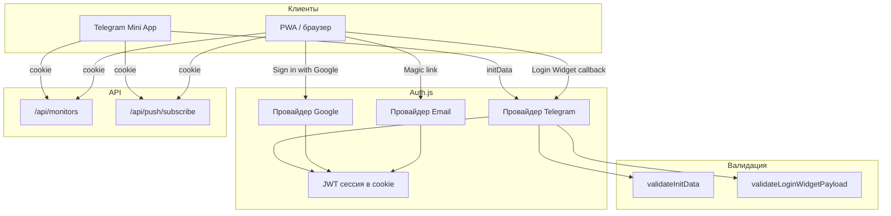
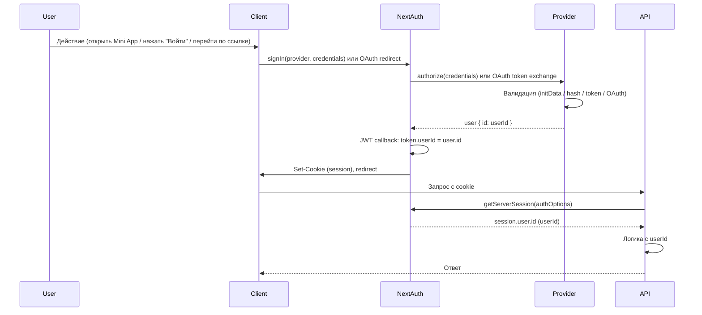

# Архитектура аутентификации

## Общая схема

Все клиенты (Telegram Mini App, PWA в браузере) в итоге получают одну и ту же сессию Auth.js (JWT в cookie). API роуты читают `userId` из сессии через `getServerSession(authOptions)`.



## Компоненты

### 1. Auth.js (NextAuth)

- **Роль**: единая точка входа для входа и выхода, хранение сессии.
- **Сессия**: JWT в HTTP-only cookie, срок жизни 24 часа.
- **Идентификатор пользователя**: в JWT и в `session.user.id` записывается единый `userId`:
  - Telegram: `tg_<telegram_id>`
  - Google: `google_<sub>`
  - Email: `email_<sha256(email)[:16]>`

### 2. Провайдер Telegram (Credentials)

- **Два входа**:
  - **initData** — строка из `Telegram.WebApp.initData` (Mini App). Проверка: HMAC-SHA256 с ключом `WebAppData` и bot token.
  - **telegramWidgetToken** — одноразовый JWT, выданный callback’ом после проверки данных Login Widget (hash через SHA256(bot_token)).
- **Модуль валидации**: `lib/telegram-auth.ts` (`validateInitData`, `validateLoginWidgetPayload`, `telegramUserId`).

### 3. Провайдер Google (OAuth2)

- Стандартный OAuth2 Authorization Code flow.
- Authorization Server — Google; приложение — OAuth2 client.
- В callback JWT пишется `userId = google_${profile.sub}`.

### 4. Провайдер Email (Credentials)

- Одноразовые токены в Firestore (коллекция `auth_tokens`): `token`, `email`, `userId`, `expiresAt`.
- Ссылка в письме ведёт на `/api/auth/email/verify?token=...` → редирект на `/login?email_token=...`.
- На странице входа вызывается `signIn("email", { emailToken })`; в `authorize()` токен проверяется и потребляется, возвращается пользователь с `id = email_<hash>`.

### 5. Защита API

- **POST/GET /api/monitors**, **POST /api/push/subscribe**: при наличии сессии `userId` берётся из `getServerSession()`, иначе из body/query (обратная совместимость).
- **GET/DELETE /api/monitors/[id]**: при наличии сессии проверяется `monitor.userId === session.user.id`; иначе 403.

## Схема потоков данных (упрощённо)



## Файловая структура (auth)

```
apps/web/
├── lib/
│   ├── auth.ts              # authOptions, createTelegramWidgetToken
│   ├── telegram-auth.ts     # validateInitData, validateLoginWidgetPayload, telegramUserId
│   └── firestore/
│       └── authTokens.ts    # createEmailToken, verifyEmailToken
├── app/
│   ├── api/auth/
│   │   ├── [...nextauth]/route.ts   # NextAuth handler
│   │   ├── telegram/callback/route.ts
│   │   └── email/
│   │       ├── route.ts             # POST — отправить magic link
│   │       └── verify/route.ts       # GET — редирект с token на /login
│   ├── (main)/
│   │   ├── login/page.tsx
│   │   └── _components/AuthLinks.tsx
│   └── (tg)/
│       ├── layout.tsx
│       └── _components/TgAuthProvider.tsx
└── types/
    └── next-auth.d.ts       # Расширение Session (user.id)
```

Подробные пошаговые сценарии: [Сценарии входа](./flows.md).
