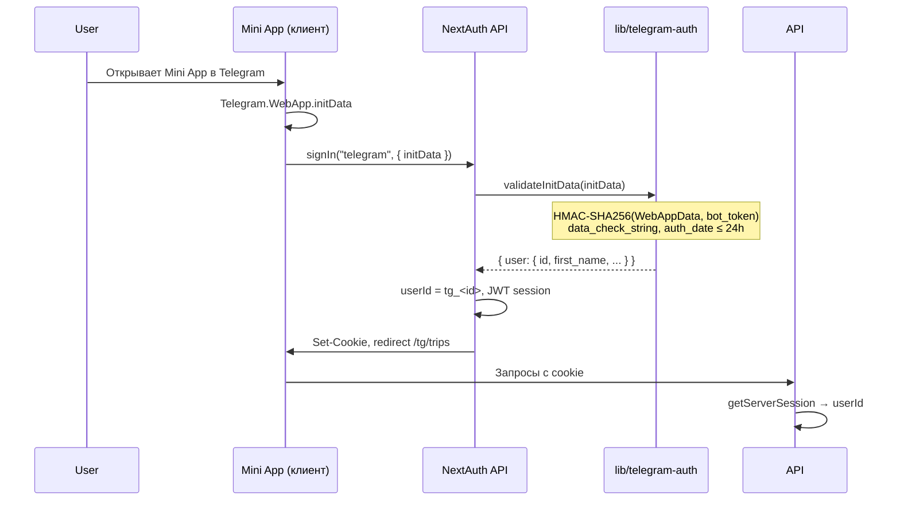
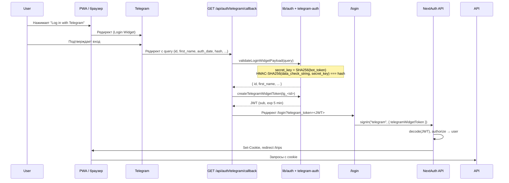
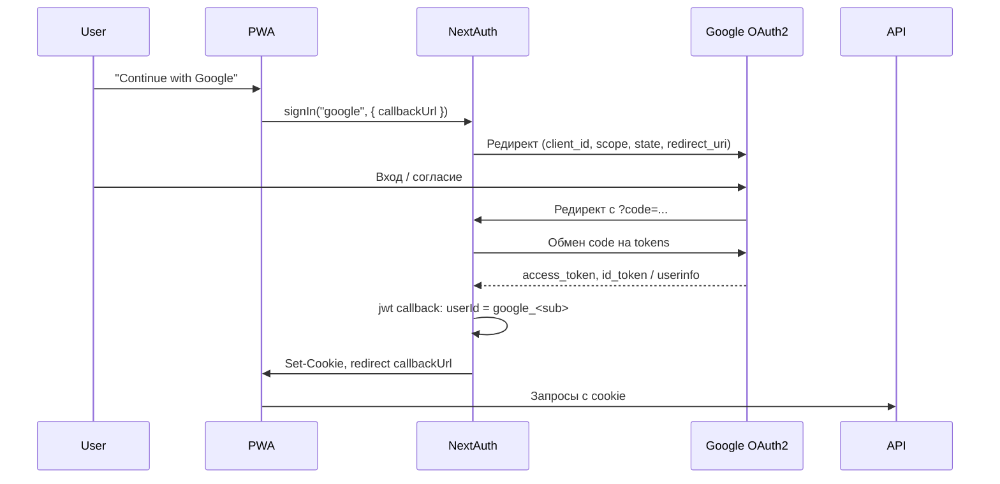
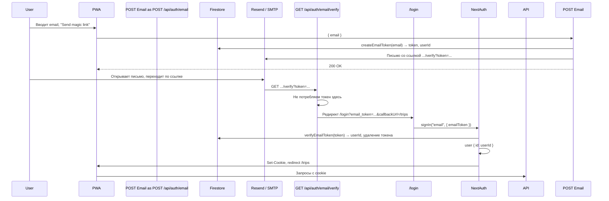

# Сценарии входа

Подробное описание каждого способа аутентификации с диаграммами и шагами.

---

## 1. Telegram Mini App (initData)

Используется, когда приложение открыто **внутри Telegram** (как Mini App). Telegram передаёт подписанные данные в `Telegram.WebApp.initData`.

### Схема потока



### Шаги

1. **Клиент (layout Mini App)**  
   В `app/(tg)/_components/TgAuthProvider.tsx` при монтировании читается `window.Telegram.WebApp.initData`. Если есть и пользователь не авторизован, вызывается:
   ```ts
   signIn("telegram", { initData, callbackUrl: "/tg/trips", redirect: true });
   ```

2. **NextAuth**  
   Отправляется POST на эндпоинт Credentials с полем `initData`.

3. **Провайдер Telegram** (`lib/auth.ts`)  
   В `authorize(credentials)` вызывается `validateInitData(credentials.initData)` из `lib/telegram-auth.ts`:
   - Парсинг query-строки, извлечение `hash` и остальных полей.
   - Сборка `data_check_string` (поля кроме `hash`, сортировка по ключу, формат `key=value\n`).
   - Вычисление: `secret_key = HMAC-SHA256("WebAppData", TELEGRAM_BOT_TOKEN)`; проверка `hash === hex(HMAC-SHA256(secret_key, data_check_string))`.
   - Проверка `auth_date` (не старше 24 ч).
   - Парсинг поля `user` (JSON), проверка `user.id`, `user.first_name`.
   - Возврат `{ id: telegramUserId(user.id), name: user.first_name, ... }`.

4. **Сессия**  
   NextAuth записывает в JWT `userId` (формат `tg_<id>`), выставляет cookie, редирект на `callbackUrl`.

5. **Дальнейшие запросы**  
   Все запросы к API идут с cookie; в роутах вызывается `getServerSession(authOptions)`, `userId` берётся из `session.user.id`.

### Где используется

- Route group `(tg)`: страницы `/tg`, `/tg/trips`, `/tg/monitors`.
- Один раз при открытии Mini App (если есть initData и нет сессии).

---

## 2. Telegram Login Widget (PWA)

Используется на **обычном сайте** (PWA): кнопка «Log in with Telegram», редирект на Telegram и обратно с query-параметрами и подписью.

### Схема потока



### Шаги

1. **Виджет на /login**  
   Подключается скрипт Telegram Login Widget с `data-auth-url` = `https://<origin>/api/auth/telegram/callback`. При нажатии кнопки пользователь уходит на Telegram и после подтверждения возвращается на этот URL с query: `id`, `first_name`, `last_name`, `username`, `photo_url`, `auth_date`, `hash`.

2. **GET /api/auth/telegram/callback**  
   - Собирается объект `query` из `request.nextUrl.searchParams`.
   - Вызов `validateLoginWidgetPayload(query)` в `lib/telegram-auth.ts`:
     - `secret_key = SHA256(TELEGRAM_BOT_TOKEN)`.
     - Сборка `data_check_string` (все поля кроме `hash`, сортировка, `key=value\n`).
     - Проверка `hash === hex(HMAC-SHA256(data_check_string, secret_key))`.
     - Проверка `auth_date` (не старше 24 ч).
   - При успехе: `userId = telegramUserId(user.id)` (формат `tg_<id>`).
   - Вызов `createTelegramWidgetToken(userId)` в `lib/auth.ts`: создаётся JWT с `sub: userId`, `exp: now + 5 min`, подпись через `AUTH_SECRET`.
   - Редирект на `/login?telegram_token=<JWT>`.

3. **Страница /login**  
   В `useEffect` читается `searchParams.get("telegram_token")`. Если есть — вызывается:
   ```ts
   signIn("telegram", { telegramWidgetToken: telegramToken, callbackUrl: "/trips", redirect: true });
   ```

4. **Провайдер Telegram**  
   В `authorize(credentials)` срабатывает ветка `credentials.telegramWidgetToken`:
   - Декодирование JWT через `decode({ token, secret: AUTH_SECRET })`.
   - Проверка `exp`, `sub` (должен начинаться с `tg_`).
   - Возврат `{ id: userId, name: "Telegram User", ... }`.

5. **Сессия и редирект**  
   NextAuth создаёт сессию, выставляет cookie, редирект на `/trips` (или другой `callbackUrl`).

### Зачем одноразовый JWT

NextAuth не умеет «установить сессию» с сервера по произвольным данным. Callback только проверяет данные от Telegram и не имеет доступа к форме на клиенте. Поэтому callback выдаёт **одноразовый JWT** (короткий срок жизни), а уже страница `/login` отправляет его в NextAuth через `signIn("telegram", { telegramWidgetToken })`, и сессия создаётся стандартным Credentials flow.

---

## 3. Google (OAuth2)

Классический OAuth2 Authorization Code flow. Authorization Server — Google.

### Схема потока



### Шаги

1. На странице `/login` кнопка вызывает `signIn("google", { callbackUrl: "/trips" })` (показывается только если заданы `GOOGLE_CLIENT_ID` и `GOOGLE_CLIENT_SECRET` и при необходимости `NEXT_PUBLIC_GOOGLE_ENABLED=true`).

2. NextAuth перенаправляет на Google; после входа Google редиректит обратно с `code`.

3. NextAuth обменивает `code` на токены и получает профиль пользователя.

4. В `callbacks.jwt` в `lib/auth.ts`: при `account.provider === "google"` устанавливается `token.userId = "google_" + token.sub`.

5. В `callbacks.session` в объект сессии попадает `session.user.id = token.userId`.

В API дальше используется тот же `session.user.id` (`google_<sub>`).

---

## 4. Email (magic link)

Вход по ссылке из письма. Токен хранится в Firestore и используется один раз.

### Схема потока



### Шаги

1. **POST /api/auth/email**  
   - Валидация email.
   - `createEmailToken(email)` в `lib/firestore/authTokens.ts`: генерируется случайный токен, в Firestore (`auth_tokens`) сохраняются `token`, `email`, `userId = email_<hash>`, `expiresAt` (1 час).
   - Отправка письма (Resend или в dev — лог в консоль) со ссылкой `https://<origin>/api/auth/email/verify?token=<token>`.

2. **Пользователь переходит по ссылке**  
   GET `/api/auth/email/verify?token=...` не проверяет токен сам, а сразу редиректит на `/login?email_token=<token>&callbackUrl=/trips`, чтобы токен попал на страницу входа.

3. **Страница /login**  
   В `useEffect` при наличии `email_token` вызывается:
   ```ts
   signIn("email", { emailToken: emailToken, callbackUrl, redirect: true });
   ```

4. **Провайдер Email**  
   В `authorize(credentials)` вызывается `verifyEmailToken(credentials.emailToken)`:
   - Поиск документа в `auth_tokens` по полю `token`.
   - Проверка `expiresAt`.
   - Возврат `userId`, **удаление документа** (одноразовое использование).
   - Возврат пользователя `{ id: userId, ... }`.

5. **Сессия**  
   NextAuth создаёт сессию с `userId` формата `email_<hash>`.

### Формат userId для email

В `lib/firestore/authTokens.ts`: `userId = "email_" + sha256(normalizedEmail).slice(0, 16)`, чтобы один и тот же email всегда давал один и тот же идентификатор без хранения email в сессии.

---

## Сводная таблица

| Способ        | Где инициируется      | Что проверяется                    | Где создаётся сессия   | Формат userId   |
|---------------|------------------------|------------------------------------|-------------------------|-----------------|
| Mini App      | (tg) layout            | initData (HMAC WebAppData)         | NextAuth Credentials    | `tg_<id>`       |
| Login Widget  | /login → Telegram      | query hash (SHA256 bot token)      | Callback → JWT → signIn | `tg_<id>`       |
| Google        | /login                 | OAuth2 code exchange               | NextAuth OAuth          | `google_<sub>`  |
| Email         | /login → письмо        | Токен в Firestore, TTL             | NextAuth Credentials    | `email_<hash>`  |

Во всех случаях итоговый идентификатор доступен в API как `session.user.id` после `getServerSession(authOptions)`.

Далее: [API и конфигурация](./api-and-config.md).
